 

&nbsp;&nbsp;&nbsp;

 

## ❯ sobre

Sou **Desenvolvedor Full Stack** e trabalho com o ecossistema JavaScript e TypeScript de ponta a ponta. Gosto de pegar um problema do começo ao fim: modelar os dados, desenhar a API, construir a interface e acompanhar o que acontece depois do deploy.

No backend, desenvolvo APIs REST e serviços com **Node.js** e **NestJS**, com arquitetura limpa, SOLID e testes. No frontend, construo interfaces com **React** e **Next.js**, de olho em performance, acessibilidade e na experiência de quem usa. E uso IA no fluxo de trabalho, com revisão e boas práticas, para entregar mais rápido sem perder qualidade.

## ❯ stack

<table>
  <tr>
    <td width="150"><b>Backend</b></td>
    <td></td>
  </tr>
  <tr>
    <td><b>Frontend</b></td>
    <td></td>
  </tr>
  <tr>
    <td><b>Cloud & DevOps</b></td>
    <td></td>
  </tr>
  <tr>
    <td><b>IA no fluxo</b></td>
    <td>
      
      
      
      
    </td>
  </tr>
  <tr>
    <td><b>Práticas</b></td>
    <td><code>Clean Architecture</code> <code>SOLID</code> <code>TDD</code> <code>Design Patterns</code> <code>REST APIs</code> <code>Microsserviços</code> <code>CI/CD</code></td>
  </tr>
</table>

## ❯ formação

- 🎓 **Pós-graduação em Arquitetura e Desenvolvimento Java**
- 🎓 **Tecnólogo em Análise e Desenvolvimento de Sistemas**

 

<picture>
  <source media="(prefers-color-scheme: dark)" srcset="https://raw.githubusercontent.com/DouglasVulcano/DouglasVulcano/output/snake-dark.svg" />
  <source media="(prefers-color-scheme: light)" srcset="https://raw.githubusercontent.com/DouglasVulcano/DouglasVulcano/output/snake-light.svg" />
  
</picture>

📍 São Paulo, Brasil · <code>❯ git commit -m "vamos conversar?"</code> no <a href="https://www.linkedin.com/in/douglas-da-silva-vulcano/">LinkedIn</a>

